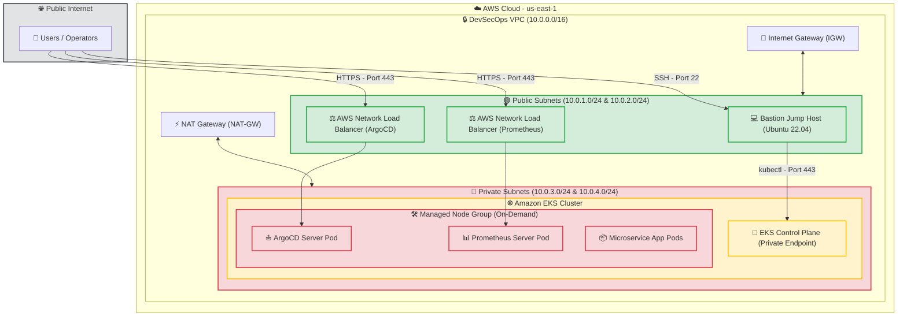

# AWS EKS DevSecOps Infrastructure Guide

This directory houses the complete, modular Terraform code to provision a secure, scalable, enterprise-grade **AWS Elastic Kubernetes Service (EKS)** infrastructure. It is designed following modern DevSecOps best practices, featuring a hardened network, private cluster endpoints, jump host isolation (Bastion), automated application load balancing, GitOps continuous delivery, and comprehensive cluster observability.

---

## 🗺️ Architectural Blueprint

The architecture is deployed in a custom Virtual Private Cloud (VPC) across multiple Availability Zones (AZs) for high availability. 

### Infrastructure Layout & Traffic Flow

Below is the conceptual architecture of the network design, private subnet isolation, and secure access boundaries:



---

## 🛠️ Infrastructure Component Breakdown

### 1. Network Topology (`vpc.tf` & `main.tf`)
- **VPC Address Space**: `10.0.0.0/16` CIDR block.
- **Public Subnets**: Two subnets (`10.0.1.0/24` in `us-east-1a` and `10.0.2.0/24` in `us-east-1b`).
  - Mapped to assign public IPs on launch.
  - Houses the **Bastion Host** and external **Network Load Balancers (NLBs)**.
- **Private Subnets**: Two subnets (`10.0.3.0/24` in `us-east-1a` and `10.0.4.0/24` in `us-east-1b`).
  - Isolated from the internet. All egress traffic goes through the **NAT Gateway** residing in the public subnet.
  - Houses the **EKS Control Plane** and **EC2 Worker Nodes** to ensure zero direct external exposure.
- **Routing & Gateways**:
  - **Internet Gateway (IGW)** routes public subnet traffic to the internet.
  - **NAT Gateway (NAT-GW)** (with Elastic IP) routes private subnet outgoing traffic.

### 2. Hardened Security & Isolation (`bastion.tf`)
- **Private EKS Endpoint**: EKS cluster endpoint access is strictly private (`endpoint_private_access = true`), meaning the Kubernetes API server cannot be reached directly from the internet.
- **Bastion Jump Host**:
  - Provisioned in the public subnet (`t3.micro` using Ubuntu 22.04 LTS).
  - Configured with an IAM Role carrying `AdministratorAccess` (instance profile) to permit administration.
  - Securely bootstrapped using `infra/scripts/bootstrap.sh` to automatically install **AWS CLI v2** and **kubectl**.
- **Security Groups**:
  - **Bastion SG**: Restricts SSH (22) and HTTPS (443) inbound strictly, allowing operators safe terminal access.
  - **EKS Cluster SG**: Restricts inbound Kubernetes API server access (port 443) **exclusively** to traffic originating from the **Bastion SG**.

### 3. Compute & Scaling (`eks.tf`)
- **EKS Engine**: Running **Kubernetes v1.31** (as configured in variables).
- **On-Demand Node Group**:
  - Deployments scale inside private subnets across multiple AZs.
  - Instances run on `t3.medium` instances (configurable) to support microservices.
  - Managed capacity handles rolling OS and software updates with a `max_unavailable = 1` policy.

### 4. IAM Roles & Kubernetes Service Accounts (IRSA) (`iam.tf` & `k8s_lb_iam_roles.tf`)
- **OIDC Provider**: An OpenID Connect (OIDC) identity provider is established for the cluster.
- **IAM Roles for Service Accounts (IRSA)**: Integrates AWS IAM permissions directly with Kubernetes service accounts without creating node-wide credentials:
  - **AWS Load Balancer Controller**: Associated with `AWSLoadBalancerControllerRole` via OIDC to permit automated AWS ALB/NLB creations.
  - **EBS CSI Driver**: Associated with `ebs-csi-role` using the `AmazonEBSCSIDriverPolicy` to dynamically provision and attach AWS Elastic Block Store (EBS) persistent volumes.

---

## ⛵ GitOps & Observability Add-Ons

We utilize Helm releases inside Terraform to pre-bootstrap our GitOps pipeline and monitoring layers.

### 1. AWS Load Balancer Controller (`helm_lb_controller.tf`)
- Deploys the official `aws-load-balancer-controller` Helm chart.
- Runs inside the `aws-load-balancer-controller-ns` namespace.
- Automates the creation of AWS Application Load Balancers (ALBs) for Ingresses and Network Load Balancers (NLBs) for LoadBalancer-type Services.

### 2. ArgoCD GitOps Engine (`argocd_helm.tf`)
- Installs the official `argo-cd` Helm chart in the `argocd` namespace.
- **Exposing ArgoCD**: Configured with a `LoadBalancer` service type featuring AWS NLB annotations:
  - `aws-load-balancer-type: "nlb"`
  - `aws-load-balancer-scheme: "internet-facing"`
- This dynamically provisions an internet-facing AWS Network Load Balancer allowing you to connect your Git repositories and manage microservices continuously using declarative GitOps definitions.

### 3. Monitoring & Observability (`prometheus_helm.tf`)
- Installs the community-standard `kube-prometheus-stack` Helm chart.
- Deploys Prometheus Operator, Alertmanager, and Grafana dashboards for EKS cluster observability.
- **Configured Features**:
  - `podSecurityPolicies.enabled: false` (ensuring compatibility with modern Kubernetes versions where PSPs are removed).
  - Exposes the Prometheus Server UI externally via an internet-facing AWS NLB.
  - Configures **Persistent Storage** using the EBS CSI Driver (`server.persistentVolume.enabled = true`) utilizing a `standard` storage class with a `10Gi` storage limit to retain monitoring metrics through pod restarts.

---

## 📂 Infrastructure Directory Structure

```text
infra/
├── env/
│   └── dev/
│       └── eks/
│           ├── .terraform.lock.hcl     # Provider lock definitions
│           ├── argocd_helm.tf          # ArgoCD GitOps Helm release configuration
│           ├── backend.tf              # AWS Provider & S3 Remote State Backend
│           ├── dev.tfvars              # Environment-specific variables for Dev EKS
│           ├── helm_lb_controller.tf   # AWS Load Balancer Controller Helm release
│           ├── iam_policy.json         # AWS Load Balancer Controller IAM Policy
│           ├── k8s_lb_iam_roles.tf     # IAM Roles/Service Accounts for LB Controller
│           ├── main.tf                 # EKS Environment Module Call
│           ├── prometheus_helm.tf      # Prometheus (kube-prometheus-stack) Helm release
│           └── variables.tf            # Variables declarations for Dev EKS Environment
├── modules/
│   ├── bastion.tf                      # Bastion host instance, SG, profile & IAM
│   ├── eks.tf                          # EKS cluster, OIDC provider, Add-ons & Node Groups
│   ├── gather.tf                       # TLS Certificates & IAM Policy documents
│   ├── iam.tf                          # EKS Cluster, Node Group, and EBS CSI IAM Roles
│   ├── outputs.tf                      # Core outputs (OIDC, endpoint, credentials)
│   ├── variables.tf                    # Base input variables for modules
│   └── vpc.tf                          # VPC, subnets, route tables, IGW, NAT, EKS SG
└── scripts/
    └── bootstrap.sh                    # User Data bash script for Bastion host configuration
```

---

## 🚀 Deployment & Operations Command Reference

Run all commands from the environment directory:
```bash
cd infra/env/dev/eks
```

### 1. AWS Credentials & Authentication
Before running Terraform, configure your local terminal session with active AWS credentials:
```bash
# Configure standard CLI credentials
aws configure

# Or verify active identity
aws sts get-caller-identity
```

### 2. Initialization & Backend Setup
Initialize Terraform to configure the S3 remote state bucket, download the required HCL providers (`aws`, `helm`, `kubernetes`, `argocd`), and load internal modules:
```bash
terraform init
```

### 3. Code Validation & Formatting
Always check that code is syntactically sound and formatted correctly before planning:
```bash
# Format HCL files recursively
terraform fmt -recursive ../../../

# Validate active environment resources
terraform validate
```

### 4. Lifecycle Execution & Planning
Generate a local execution plan detailing the resources to build and save it to an encrypted output file:
```bash
# Create plan
terraform plan -var-file=./dev.tfvars -out=plan

# Apply the approved plan to AWS
terraform apply plan
```

### 5. Post-Deployment: Connecting to the Cluster
Since the EKS cluster API server has **private access only**, you must authenticate and execute `kubectl` commands through the **Bastion Jump Host**.

#### Step A: Retrieve the SSH Private Key
If you used an AWS Key Pair named `eks-admin`, secure the SSH key:
```bash
chmod 400 ~/.ssh/eks-admin.pem
```

#### Step B: SSH Into the Bastion Host
Fetch the Bastion public IP from the AWS Console or command outputs and SSH in:
```bash
ssh -i ~/.ssh/eks-admin.pem ubuntu@<BASTION_PUBLIC_IP>
```

#### Step C: Update Kubeconfig on the Bastion Host
Once logged into the Bastion, configure `kubectl` to communicate with the EKS cluster:
```bash
aws eks update-kubeconfig --region us-east-1 --name dev-Devsecops-org-eks-devsecops-cluster
```

#### Step D: Verify EKS Cluster Operations
Now, you can execute cluster inspection commands securely:
```bash
# Get nodes
kubectl get nodes -o wide

# Check GitOps and Monitoring deployments
kubectl get pods -n argocd
kubectl get pods -n prometheus
kubectl get pods -n aws-load-balancer-controller-ns
```

### 6. Tearing Down Infrastructure
To prevent ongoing AWS costs, completely destroy all created resources:
```bash
terraform destroy -var-file=./dev.tfvars
```
